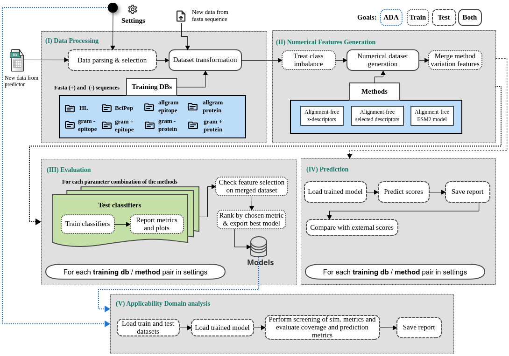

# PAPreC - Pipeline for Antigenicity Predictor Comparison

Python pipeline to prepare epitopes and protein sequence datasets, extract numerical features from sequence with alignment-free methods, perform model evaluation and test model performance upon feature selection.

## Summary

We have developed a comprehensive pipeline for comparing models used in antigenicity prediction. This pipeline encompasses a range of experiment configurations that systematically modify four key parameters: (1) the source dataset, encompassing datasets Bcipep, hla and Protegen (Yang et al. 2011); (2) the alignment-free method employed for generating numerical features; and (3) the utilization of nine distinct classifiers. 

<div style="text-align: center">
	
</div>


## Requirements:
* The packages are stated in the environment's exported file: paprec_env.yml

## Usage Instructions
### Preparation:
1. ````git clone https://github.com/YasCoMa/paprec_pipeline.git````
2. ````cd paprec_pipeline````
3. ````conda env create --file paprec_env.yml````
4. Setup the environment variable with the path to the workflw directory: ```` export paprecPath="/path/to/paprec_workflow" ````
5. The workflow requires four parameters, you can edit them in main.nf, or pass in the command line when you start the execution. The parameters are:
	- **mode**: Indicates the goal of the workflow, 'train' or 'test'. It activates accordingly the steps according to the mode.
	- **execution_step**: If 0 it runs all the steps of the workflow, the other options can be as described below.
		- 1 - Transform fasta protein sequences into tabular data comprised of numerical features.
		- 2 - Evaluates the model and saves the one that yielded the best metrics
		- 3 - Perform explainability analysis
		- 4 - Perform applicability domain analysis.
	- **dataDir**: The directory where the generated files will be stored
	- **runningConfig**: A json file with the configuration setup desired by the user. It basically contains information about the datasets and feature extraction methods that the user wants to activate in the execution. The user can be very specific stating each individual pair combination of dataset and method, or signaling the "is_all_against_all" flag to prepare the features for the all the pairwise combinations of datasets and methods. Each main key of the json file is explained below.
		- datasets: The datasets available for analysis - Example: ``["hla", "bcipep", "gram+_epitope", "gram-_epitope", "gram+_protein", "gram-_protein", "allgram_epitope", "allgram_protein"]``
		- methods: The feature extraction methods implemented in modules - Example: ``["aln_free_e-descriptors", "aln_free_aaindex_descriptors", "aln_free_esm2_embedding"]``
		- experiment_combinations: It is a list with the tasks that the user ants to run, it contains the keys described below.
			- task: it can be "train", "test" or "ada". If the last option is chosen, the key "test_data" is required in order to prepare the new test set

			- is_all_against_all: The boolean flag indicating if the workflow should run all the above mentioned datasets against all the declared methods. In the "ada" mode, it will contrast all the available datasets belonging to the same target

			- [Only ada mode] extraction_method: The feature extraction method chosen to compare the datasets

			- [Only ada mode] target: The sequence type of the dataset ('protein' or 'epitope')

			- [Only ada mode] similarity_metrics: The similarity metrics to obtain the nearest neighbors. Default is the following list: ['cityblock', 'euclidean', 'rogerstanimoto', 'correlation', 'cosine']

			- [Only ada mode] perc_testset: The test set proportion (valid values range from 10 to 100). In case the all against all is True, in the same dataset as train and test, this proportion is set to 30%

			- [Only ada mode] dataset_pairs: A list of objects describing the base train dataset and the test dataset identifier. In case the all against all is True, this parameter will be ignored. Example of value: ``[ { "base": "allgram_protein", "test": "gram+_protein" } ]``

			- [Only train or test modes] pairs: A list of objects declaring the identifiers of dataset and method, this key is ignored when the "is_all_against_all" is set as true. This is useful when the user wants to run specific combinations that are more suitable to his test data. Example of values: ``[ { "dataset": "hla", "method": "aln_free_e-descriptors" } ]``

			- [only train mode] imbalance_treatment: The strategy to use in case the training dataset has distinct proportions of each class. The options are: 'smote' or 'downsampling', the default is downsampling.
			- [only train mode] rank_metric: Metric that will be used to rank the models and selecting the best for each dataset-method combination. The options are: 'accuracy', 'auc', 'recall', 'precision', 'f1', 'kappa' and 'mcc', the default is mcc.

			- [only test mode] test_data: A list of objects declaring the identifier and the path for each protein sequence fasta file that the user wants to get predictions. This key is only read when "task" has "test" as value, and in this mode the pairs key content means the models that will be used for prediction. 
				- The information for a ready fasta sequence file comprises the identifier and the path for the sequence file, and the source key as 'fasta'. Example:  ``[ { "identifier": "paeruginosa", "source": "fasta", "sequence_file": "/path/to/sequences_testset.faa" } ]``
			
				- The information when it is the raw output of the netMHCPan predictor includes not only the identifier but also the raw prediction fle path, the original protein sequence fasta file path and the curation parameters, and the source key as 'predictor'. The curation parameters are used to filter out the epitopes, and contains information about the cell type (t or b), and thresholds of similarity with iedb epitopes, number of alleles with binding afinity and the percentile rank (specific for t-cell) of binding. Example:  ``
			[ 
				{ 
					"identifier": "saureus", 
					"source": "predictor", 
					"raw_prediction_file": "/aloy/home/ymartins/paprec_2024_revision/data_organisms/saureus/results/raw_epitopes_saureus.txt", 
					"proteins_file": "/aloy/home/ymartins/paprec_2024_revision/data_organisms/saureus/saureus_seqs.faa", 
					"parameters_curation": {
					"cell_type": "t", "threshold_sim_iedb": 1, "threshold_alleles": 30, "threshold_rank": 2 }
				}
			 ]
			``
			
				Additionally, each test set may declare whether the workflow should compare the prediction of the models to another external given scores for the sequences. This can be done adding two more keys:
				- compare_to_goldenset: Indicates if you want to compare the predictions of the models to another predictor or database. The default is False
				- goldensets: A list of objects describing the sequence type target (protein or epitope), the identifier of the comparison reference and the path to the goldenset that must be a tabular file separated by tab, with two columns: 'sequence' and 'label', which are the aa sequence and the label (1 antigenic and 0 not). Example: ``[ { "target": "epitope", "identifier": "iedb_epitope", "path": "/aloy/home/ymartins/paprec_2024_revision/acc_quantification_SA-PA_application_case/out/all_iedb_saureus_29-09_epitope.tsv" } ]``


### Run Screening:
1. Examples of running configuration are shown in running_config.json and eskape_running_config.json

2. Modes of execution:
	- **Run All:**
		- ````nextflow run main.nf```` or ````nextflow run main.nf --dataDir /path/to/paprec_data --runningConfig /path/to/running_config.json --mode train --execution_step 0````
	- **Run Data Selection:**
		- ````nextflow run main.nf --dataDir /path/to/paprec_data --runningConfig /path/to/running_config.json --mode test --execution_step 1````
	- **Run Feature extraction:**
		- ````nextflow run main.nf --dataDir /path/to/paprec_data --runningConfig /path/to/running_config.json --mode test --execution_step 2````
		- Or ````nextflow run main.nf --dataDir /path/to/paprec_data --runningConfig /path/to/running_config.json --mode train --execution_step 2````
	- **Run Evaluation:**
		- ````nextflow run main.nf --dataDir /path/to/paprec_data --runningConfig /path/to/running_config.json --mode train --execution_step 3````
	- **Run Prediction:**
		- In the chosen dataDir, uncompress the trained model folders in the link https://www.dropbox.com/scl/fi/jfxkdp423lm2cs72ljm1z/models_data.tar.xz?rlkey=2ggl1jagkg5qlh6yf40brcniy&st=c40ru97j&dl=0
		- in the best_trained_models folder, adjust the model_path key in each json file to add the prefix with dataDir path.
		- Or run the training step before the prediction
		- ````nextflow run main.nf --dataDir /path/to/paprec_data --runningConfig /path/to/running_config.json --mode test --execution_step 3````
	- **Run AD Analysis (It assumes that the selected datasets finished the evaluation step):**
		- ````nextflow run main.nf --dataDir /path/to/paprec_data --runningConfig /path/to/running_config.json --mode ada ````

- Check the results obtained with those found in our article:
    - Bcipep dataset: https://www.dropbox.com/s/8ezeup4xiwb9p7n/bcipep_dataset.zip?dl=0
    - HLA dataset: https://www.dropbox.com/s/6vpfgvmsz9vd5r0/hla_dataset.zip?dl=0
    - Gram+ dataset: https://www.dropbox.com/s/l5wqpcsp4qc6ret/gram%2B_dataset.zip?dl=0
    - Gram- dataset: https://www.dropbox.com/s/cvzrhlselxj9sp5/gram-_dataset.zip?dl=0
    
### Adding more modules:
The goal is centralizing in the "raw_training_datasets" file curated training datasets that can be used for training and later prediction. The workflow was prepared to easily accept the addition of new datasets and methods.

#### Instructions for new feature extraction method:
The current paprec version contains eight training datasets: hla, bcipep, allgram_epitope, allgram_protein, gram+\_epitope, gram+\_protein, gram-\_epitope, gram-\_protein. In th elast section, there are more details about their origin.
- Steps to insert your prepared dataset:
	1. Create a Python file in the modules/feature_extraction_methods/methods  folder, containing the class of your implementation following the same pattern found in the other methods already in this folder. Pattern: Inherinting the Method meta class, and exporting a function named **build_numerical_datasets**. This function will be called during the workflow execution.
	2. Edit the files modules/feature_extraction_methods/main_feature_extraction.py and modules/applicability_domain_analysis/main_ada.py, and add a new entry in the dictionary of methods, in the function load_available_methods. In this case you can choose freely the key, but th evalue must be exactly the name of the class you created before. Example of entry: ``"aln_free_esm2_embedding": "Implementation_es2Embedding"``

#### Instructions for new dataset:
The current paprec version contains eight training datasets: hla, bcipep, allgram_epitope, allgram_protein, gram+\_epitope, gram+\_protein, gram-\_epitope, gram-\_protein. In th elast section, there are more details about their origin.
- Steps to insert your prepared dataset:
	1. Create a folder inside "raw_training_datasets", and put the fasta files corresponding to the positive and negative sets.
	2. Edit the file modules/datasets/treat_dataset.py, and add a new entry in the dictionary of datasets, in the function get_available_datasets. The key must have the same name as  the folder you have created before. Example of entry: ``"hla": { 'positive_file': 'dataset_pos.fasta', 'negative_file': 'dataset_neg.fasta' }``

You can use the new dictionary keys in datasets and methods now in the runnning configuration json file.

#### Methodology used to obtain the current training datasets
The current paprec version contains four main sources of training datasets: 
	- HLA, which is a compiled collection of curated epitopes experimentally assessed for immune recognition
through cytokines such as IL-5, IL-17, or IL-10. Type: Epitope. Source: https://doi.org/10.1186/1471-2164-6-79
	- BciPep, it contains epitopes from b-cell experiments. Type: Epitope. Source: https://doi.org/10.1186/1471-2164-6-79
	- Protegen, it comprises whole protein sequences of bacteria. Type: Protein. Source: https://doi.org/10.1093/nar/gkq944
	- IEDB, A database of epitopes validated by assays and publications that is constantly being updated. It has mainly eptopes information, but provides the protein identifier from which it was predicted, so it is possible to prepare both protein and epitope datasets. Type: Both. Source: https://doi.org/10.1093%2Fnar%2Fgky1006

In the "raw_training_datasets" folder, there files containing the prepared set of sequences for each of the four above mentioned databases. hla and bcipep were directly extracted without further data processing. But for protegen, it provides only a positive set of proteins and it was not being updated since 2019. To address the negative part and the outdated data to use it to train models, we started by getting all the taxonomy ids of the organisms that were declared n the protein sequence identifiers. We manually classified each taxon as being of a gram+ or gram- bacteria.
We augmented the positive set of proteins and epitopes, downloading iedb lists of linear epitopes that were not from b-cell type, for each taxon id. We selected either the ones that had positive or negative outcome in the assays. From these, we could derive positive and negative set of epitopes and their respective proteins.
With the taxon ids, we also looked in uniprot for their proteomes, and the respective proteins were classified as negative if they had a match of less then 30% of identity and if none of th epositive epitopes of the golden bacteria set were not found with exact match in them. This step helped to increase the negative set of proteins, for gram+ and gram- bacteria.

## Reference

## Bug Report
Please, use the [Issues](https://github.com/YasCoMa/paprec_pipeline/issues) tab to report any bug.
